# GUI 使用说明书

## 镜像备份功能

验证实现的功能为：
- 文件类型支持（满分10分）：支持特定文件系统的特殊文件（管道/链接/设备等）
- 元数据支持（满分10分）：支持特定文件系统的文件元数据（属主/时间/权限等）

使用过程

1. 选择源目录和目标目录

2. 点击`开始备份`按钮，程序会将源目录下的所有文件和子目录复制到目标目录中

   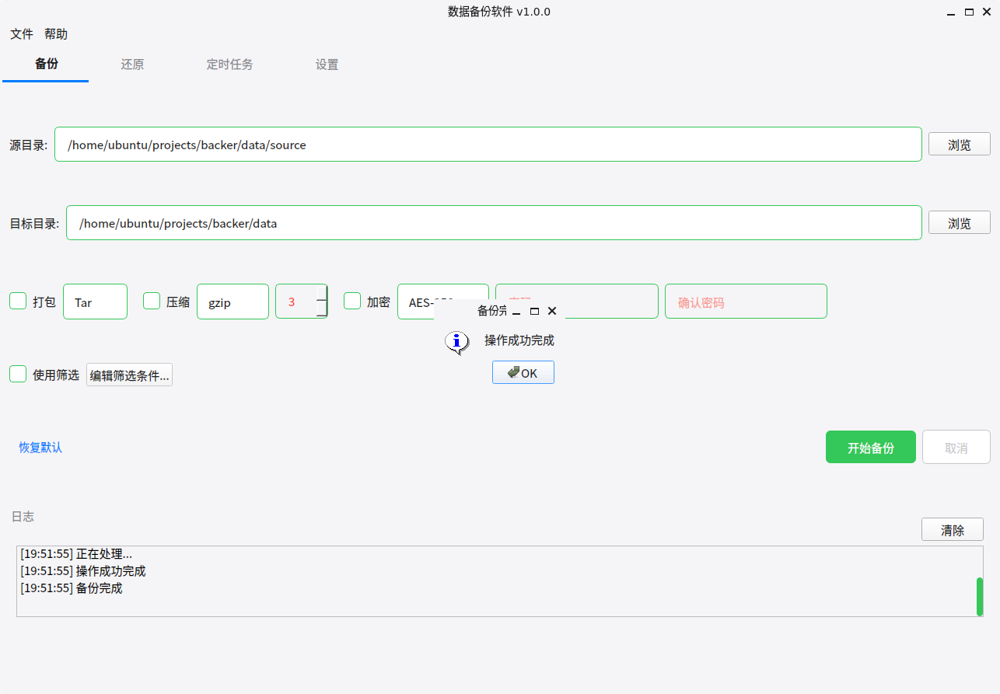

   

5. 使用`ls -l`命令验证

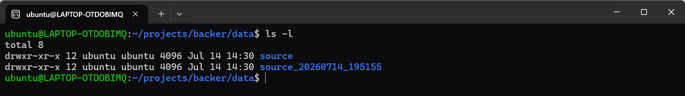

下图为使用 rsync 命令验证备份功能对元数据支持 

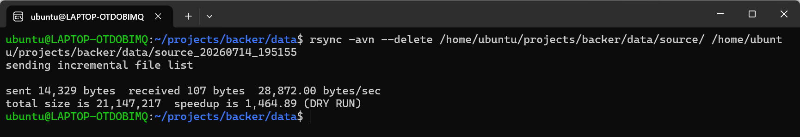

下图分别为验证备份功能对特殊文件的支持 （符号链接、 FIFO）

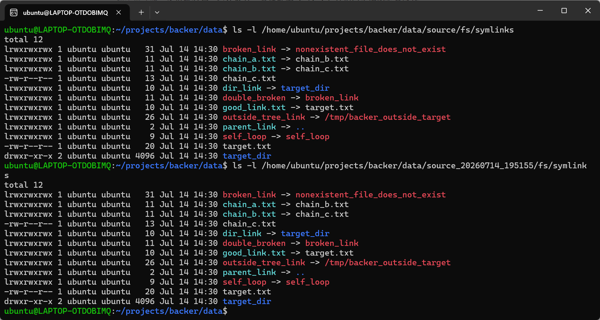

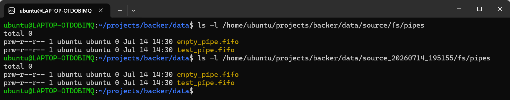

## 镜像还原功能

1. 选择备份源和还原目录

2. 点击`开始还原`按钮，程序会将备份源下的所有文件和子目录复制到还原目录中

   

   

5. 使用`ls -l`命令验证

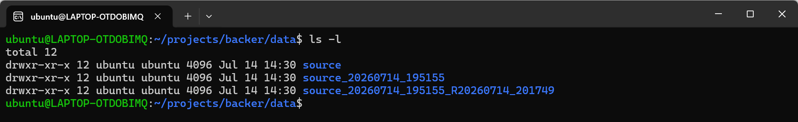

下图为使用 rsync 命令验证还原功能对元数据支持 

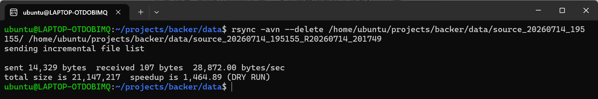

下图分别为验证还原功能对特殊文件的支持 （符号链接、 FIFO）

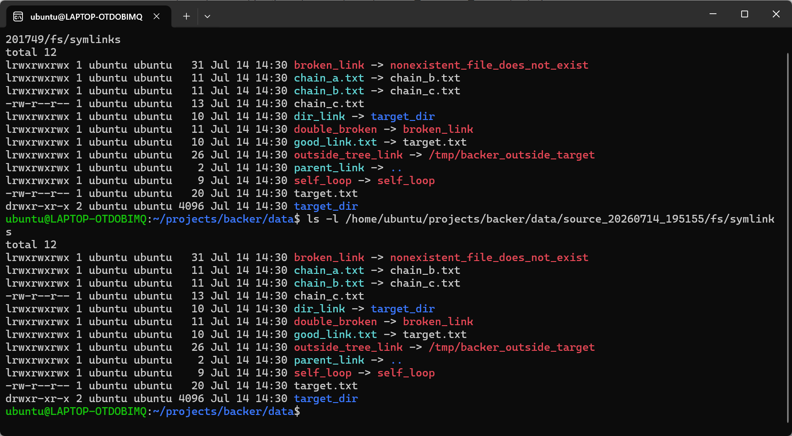

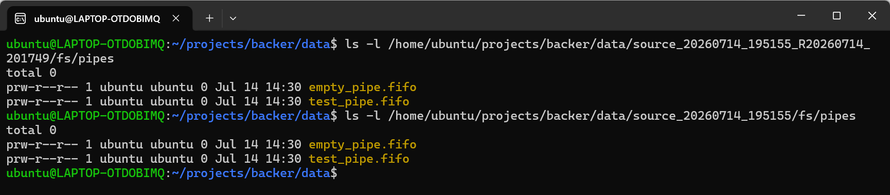

打包解包

验证实现的功能为：
- 打包解包（每种算法10分）：将所有备份文件拼接为一个大文件保存
- 压缩解压（每种算法10分）：通过文件压缩节省备份文件的存储空间

## 打包备份（tar）

1. 选择`源目录`和`目标目录`
2. 勾选`打包` 按钮，然后点击`下拉列表`选择`打包方式`（支持tar 和zip），同时可选`压缩`，点击`下拉列表`选择压缩方式`，点击`开始备份`按钮，程序会将源目录下的所有文件和子目录打包压缩到目标目录中

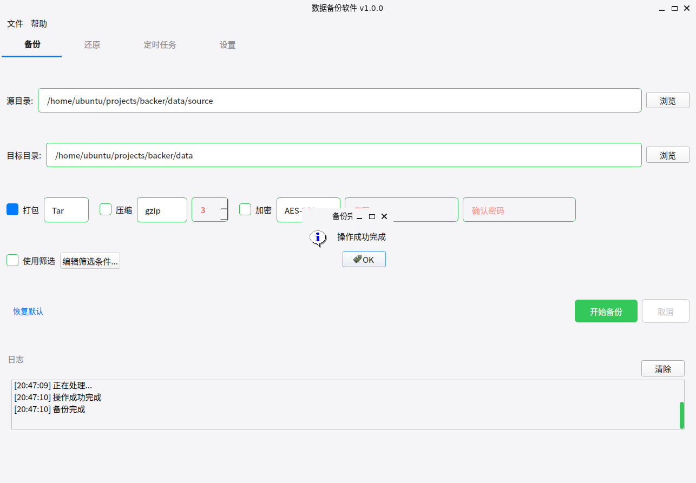

3.  使用 `ls -l`命令验证

   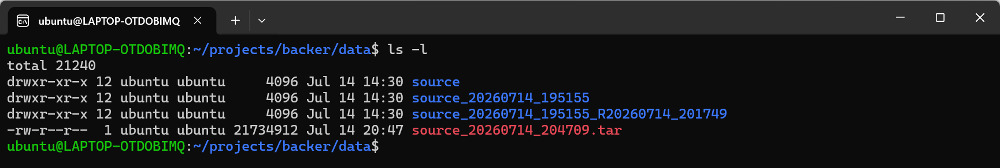

下图为验证打包备份（tar）对元数据的支持

下图分别为验证打包备份（tar）对特殊文件（符号链接、FIFO）的支持

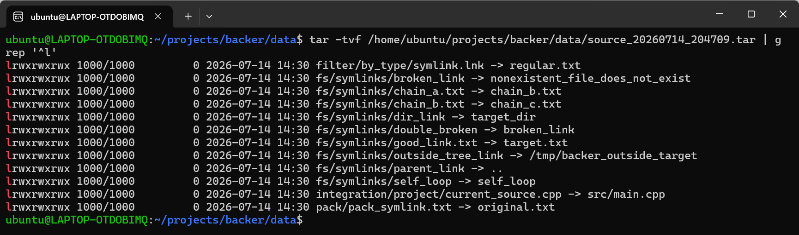

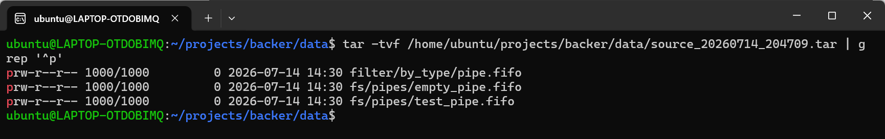

## 打包还原（tar）

1. 选择备份源和还原目录

2. 点击`开始还原`按钮，程序会将备份源下的所有文件和子目录复制到还原目录中

   

   

3. 使用`ls -l`命令验证

下图为使用 rsync 命令验证还原功能对元数据支持 

下图分别为验证还原功能对特殊文件的支持 （符号链接、 FIFO）

##  tar + gzip 压缩备份 

1. 选择`源目录`和`目标目录`
2. 勾选`打包` 按钮，然后点击`下拉列表`选择`tar打包`，同时`压缩`，点击`下拉列表`选择压缩方式`gzip`，点击`开始备份`按钮，程序会将源目录下的所有文件和子目录打包压缩备份到目标目录中

3. 使用 `ls -l`命令验证

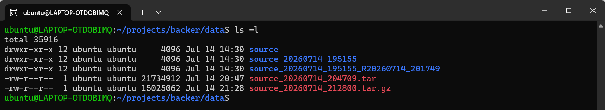

下图为验证打包备份（tar + gzip）对元数据的支持

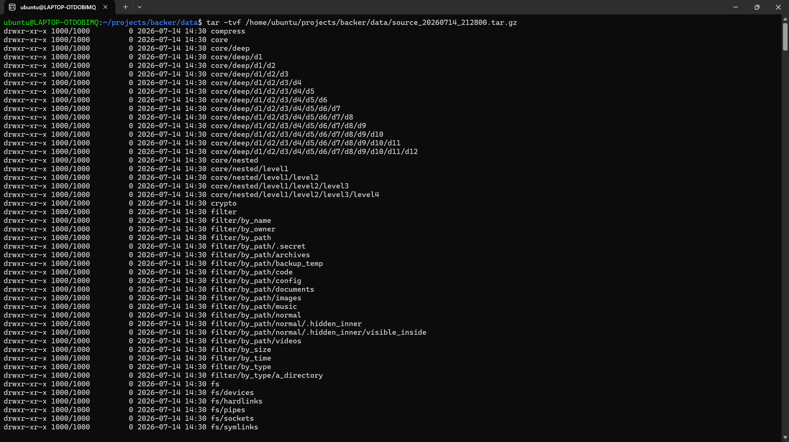

下图为验证打包压缩备份（tar + gzip）对特殊文件（符号链接、FIFO）的支持

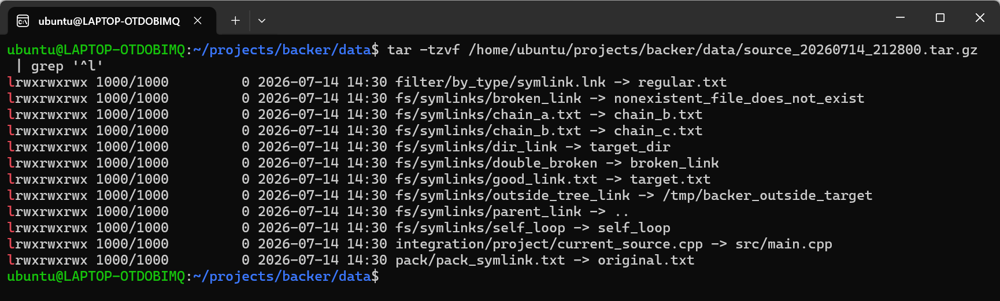

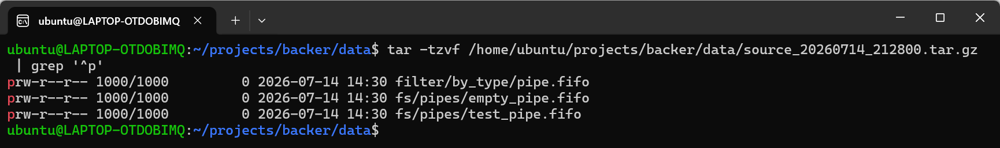

## tar + gzip 解压缩还原

1. 选择`备份源`和`还原目录`

2. 点击`开始还原`按钮，程序会将备份源下的所有文件和子目录复制到还原目录中

   

   

3. 使用`ls -l`命令验证

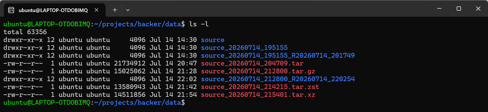

下图为使用 rsync 命令验证还原功能对元数据支持 

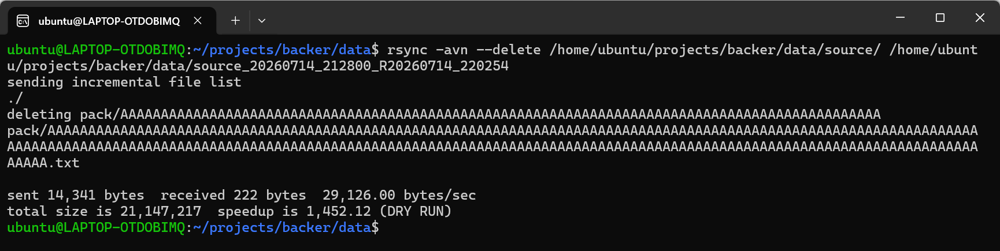

下图分别为验证还原功能对特殊文件的支持 （符号链接、 FIFO）

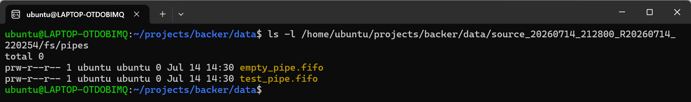

##  tar + zstd 压缩备份 

1. 选择`源目录`和`目标目录`
2. 勾选`打包` 按钮，然后点击`下拉列表`选择`tar打包`，同时`压缩`，点击`下拉列表`选择压缩方式`zstd`，点击`开始备份`按钮，程序会将源目录下的所有文件和子目录打包压缩备份到目标目录中

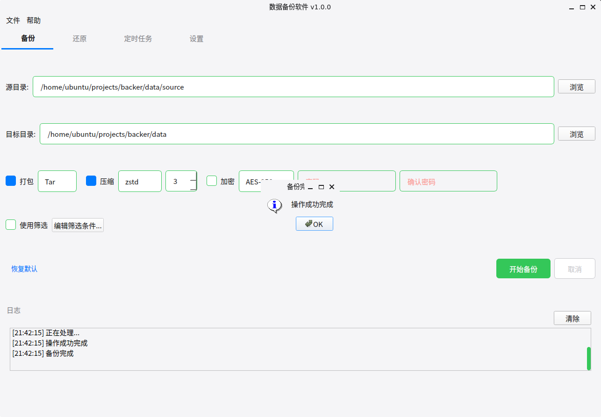

3. 使用 `ls -l`命令验证

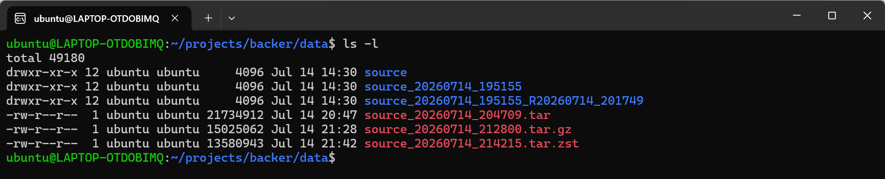

下图为验证打包备份（tar + zstd）对元数据的支持

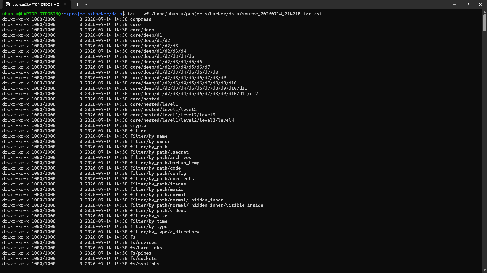

下图为验证打包压缩备份（tar + zstd）对特殊文件（符号链接、FIFO）的支持

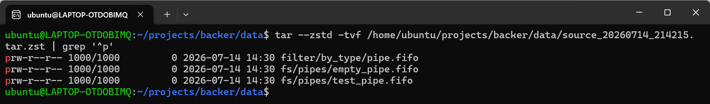

## tar + zstd 解压缩还原

1. 选择`备份源`和`还原目录`

2. 点击`开始还原`按钮，程序会将备份源下的所有文件和子目录复制到还原目录中

   

   

3. 使用`ls -l`命令验证

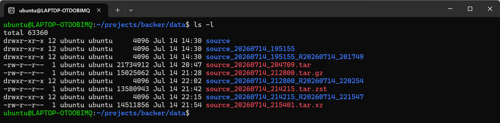

下图为使用 rsync 命令验证还原功能对元数据支持 

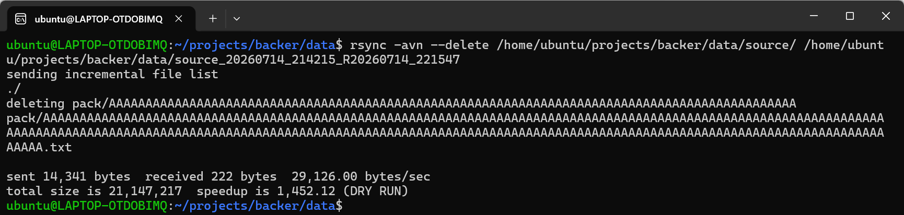

下图分别为验证还原功能对特殊文件的支持 （符号链接、 FIFO）

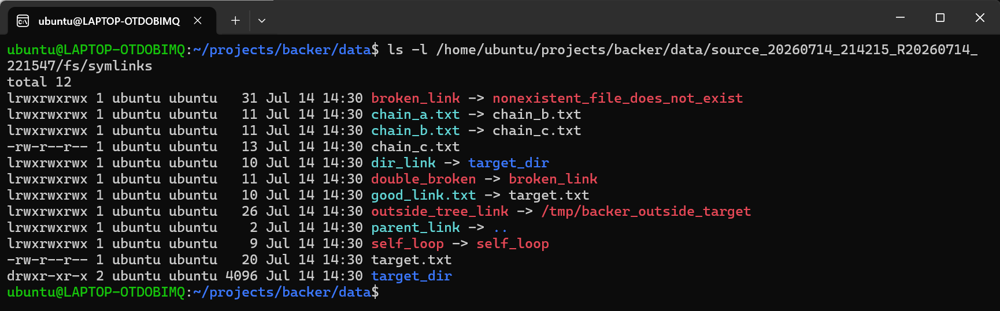

##  tar + lzma 压缩备份 

1. 选择`源目录`和`目标目录`
2. 勾选`打包` 按钮，然后点击`下拉列表`选择`tar打包`，同时`压缩`，点击`下拉列表`选择压缩方式`gzip`，点击`开始备份`按钮，程序会将源目录下的所有文件和子目录打包压缩备份到目标目录中

3. 使用 `ls -l`命令验证

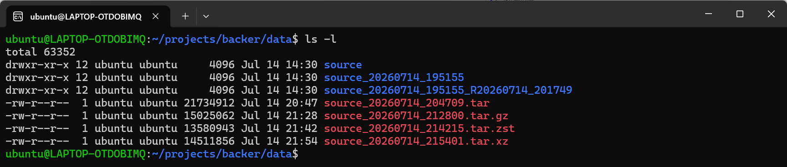

下图为验证打包备份（tar + gzip）对元数据的支持

下图为验证打包压缩备份（tar + gzip）对特殊文件（符号链接、FIFO）的支持

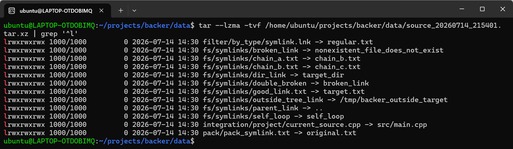

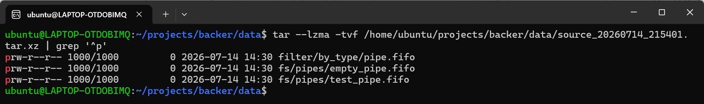

## tar + lama 解压缩还原

1. 选择`备份源`和`还原目录`

2. 点击`开始还原`按钮，程序会将备份源下的所有文件和子目录复制到还原目录中

   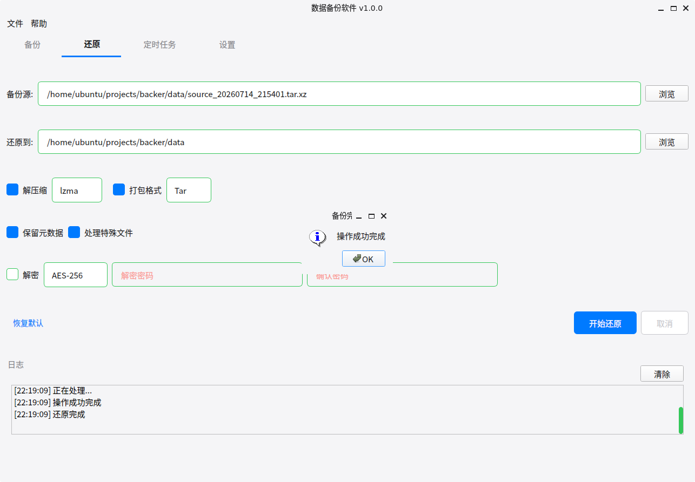

   

3. 使用`ls -l`命令验证

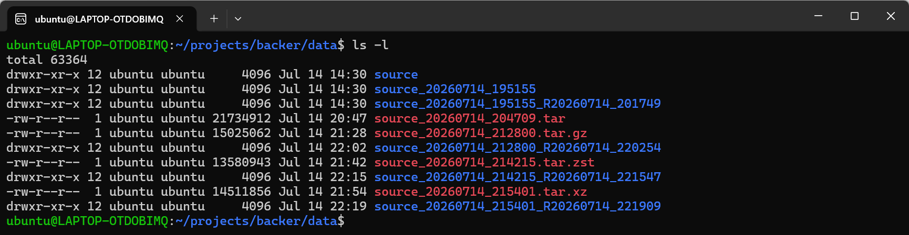

下图为使用 rsync 命令验证还原功能对元数据支持 

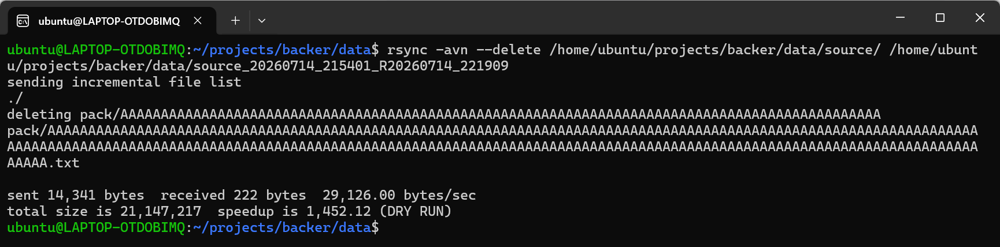

下图分别为验证还原功能对特殊文件的支持 （符号链接、 FIFO）

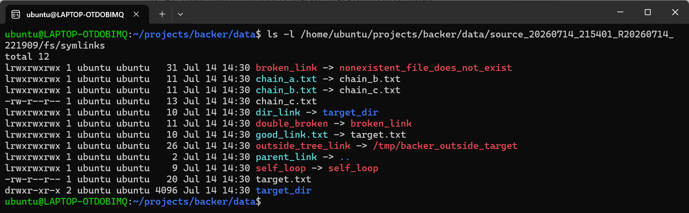

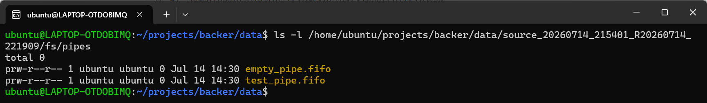

解包使用过程

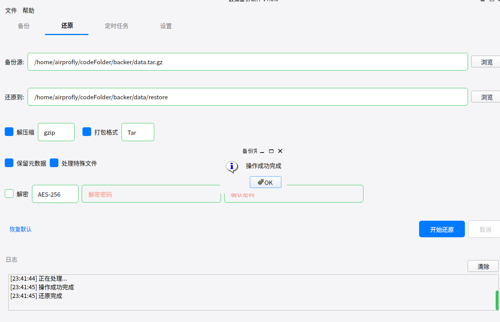
1. 切换为 `还原`模式，选择`备份源  `和 `还原目录`
2. 选择解压缩 `方式` 和 打包 `方式`，点击`开始解包`按钮，程序会将源目录下的所有文件和子目录解包解压到目标目录中
3. 使用 `ls -l`命令验证
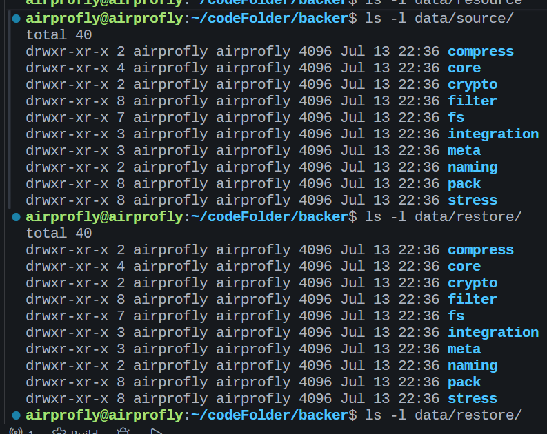

## 自定义备份

验证实现的功能为：

- 自定义备份（各3分）：支持筛选需要备份的文件（路径/类型/名字/时间/尺寸/用户）

##  Tar + AES-256 打包加密备份

1. 选择`源目录`和`目标目录`   选择`打包 Tar`  和 `加密 AES-256`

2. 点击`开始备份`按钮，程序会将源目录下的所有文件和子目录复制到目标目录中

   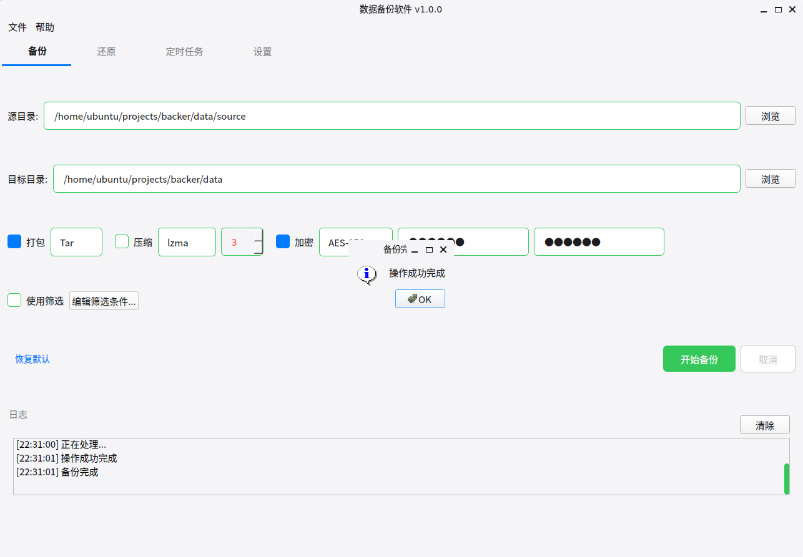

   

3. 使用`ls -l`命令验证

下图为使用 rsync 命令验证备份功能对元数据支持 

下图分别为验证备份功能对特殊文件的支持 （符号链接、 FIFO）

##  Tar + AES-256 解包解密备份

##  Tar + SM4 打包加密备份

1. 选择`源目录`和`目标目录`   选择`打包 Tar`  和 `加密 SM4`

2. 点击`开始备份`按钮，程序会将源目录下的所有文件和子目录复制到目标目录中

   

   

3. 使用`ls -l`命令验证

下图为使用 rsync 命令验证备份功能对元数据支持 

下图分别为验证备份功能对特殊文件的支持 （符号链接、 FIFO）

##  Tar + SM4 解包解密备份
