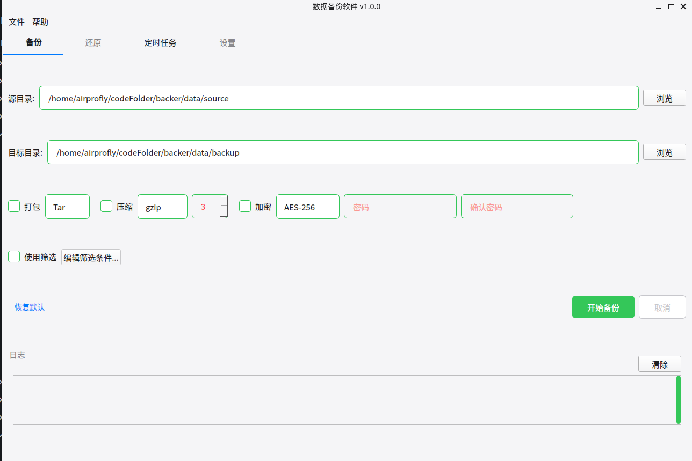
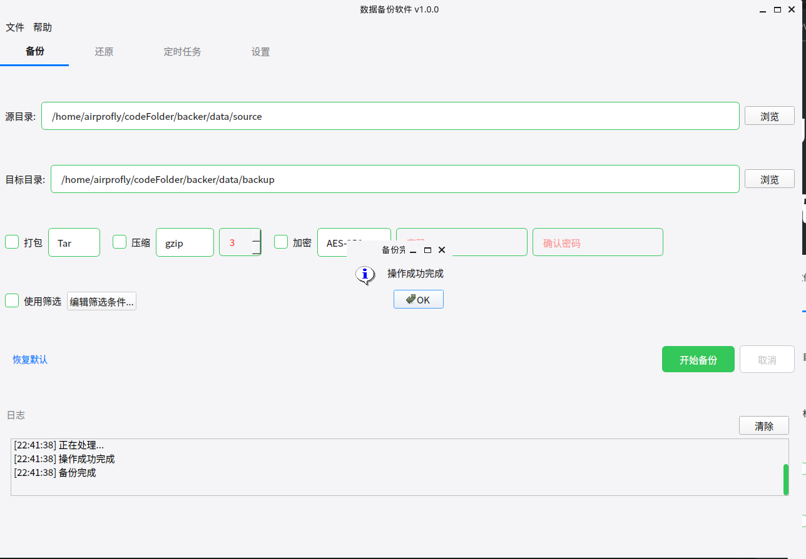
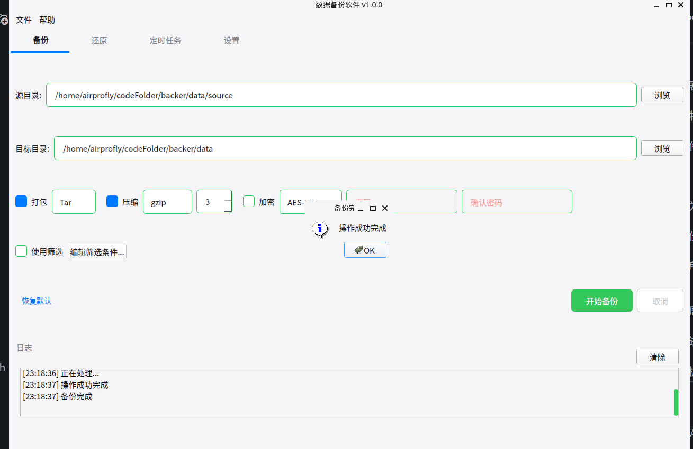

# gui 使用说明书

## 无压缩备份功能
验证实现的功能为：
- 文件类型支持（满分10分）：支持特定文件系统的特殊文件（管道/链接/设备等）
- 元数据支持（满分10分）：支持特定文件系统的文件元数据（属主/时间/权限等）

### 使用过程

1. 选择源目录和目标目录
2. 点击`开始备份`按钮，程序会将源目录下的所有文件和子目录复制到目标目录中

3. 弹窗提示`操作成功完成`，点击“确定”按钮关闭弹窗
4. 使用`ls -l`命令验证

=============================
现在备份功能的时间元数据有问题，所有**截图暂缺**,待修复补上，问题链接 https://github.com/airprofly/backer/issues/32

=============================

## 自定义备份
验证实现的功能为：
- 自定义备份（各3分）：支持筛选需要备份的文件（路径/类型/名字/时间/尺寸/用户）

## 打包解包
验证实现的功能为：
- 打包解包（每种算法10分）：将所有备份文件拼接为一个大文件保存
- 压缩解压（每种算法10分）：通过文件压缩节省备份文件的存储空间

### 打包使用过程

1. 选择`源目录`和`目标目录`
2. 勾选`打包` 按钮，然后点击`下拉列表`选择`打包方式`，同时勾选`压缩`，点击`下拉列表`选择压缩方式`，点击`开始备份`按钮，程序会将源目录下的所有文件和子目录打包压缩到目标目录中

====================
输出路径不对，有问题，截图暂缺，待修复补上，问题链接 https://github.com/airprofly/backer/issues/33

====================

### 解包使用过程

1. 切换为 `解包`模式，选择`源目录`和`目标目录`
2. 选择解压缩 `方式` 和 打包 `方式`，点击`开始解包`按钮，程序会将源目录下的所有文件和子目录解包解压到目标目录中
3. 使用 `ls -l`命令验证

## 加密和解密

==========================
现在加密和解密功能有问题，所有**截图暂缺**,待修复补上，问题链接 https://github.com/airprofly/backer/issues/34

==========================

